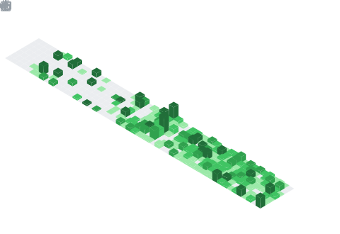

<h1 align="center">Anthony Cursewl</h1>
<h3 align="center">Full-Stack Software Engineer | Systems Architect | Computer Engineer</h3>

  Building scalable, high-performance web applications and resilient infrastructure. I specialize in domain-driven design, microservices, and crafting elegant, user-centric solutions to complex technical challenges.

  
  
  

---

### 🚀 Engineering Focus

* **Architecture & Systems:** Specializing in **Hexagonal Architecture**, building robust backend APIs, and designing scalable microservices.
* **Infrastructure & DevOps:** Experienced in server management, running **Proxmox** environments, and implementing CI/CD best practices for seamless deployments.
* **Continuous Learning:** Currently deep-diving into **Rust** for systems-level performance and expanding my expertise in **Go (Golang)** for concurrent backend services.
* **Current Ventures:** Developing SaaS products, including a high-performance software licensing system and exploring fintech solutions to modernize payment infrastructures.

---

Technical Arsenal

**Languages & Core**

  
  
  
  
  
  
  

**Frontend & Mobile**

  
  
  
  
  

**Backend & Databases**

  
  
  
  
  
  
  
  

**Infrastructure & Tools**

  
  
  
  

---

### 🏗️ Featured Architecture & Projects

| Project | Description | Stack |
| :--- | :--- | :--- |
| **Fintech Payment System** *Malet* *(In Development)* | A modern financial application aimed at streamlining and securing local payment gateways and transactions. | `NestJS` `PostgreSQL` `TypeScript` |
| **SaaS Licensing Authority** | A robust software licensing system utilizing clean architecture to manage cryptographic keys and user access tiers. | `NestJS` `Prisma` `Hexagonal Arch` |
| **[anx-streak-app](https://github.com/anthonycursewl/anx-streak-app-v2)** | A gamified personal progress and task management application designed for high-efficiency habit building. | `Vue` `Tailwind` `Node.js` |
| **[duran-app](https://github.com/anthonycursewl/meat-swt-app)** | An end-to-end retail management system handling POS, inventory tracking, and complex sales reporting. | `React` `Express` `PostgreSQL` |

---

### 📊 GitHub Activity

  
  

  

