   

# Hello, I'm Anthony Cursewl! xo

   
   

*   🌱 I'm currently learning...
    *   Hexagonal Architecture.
    *   Goland.
    *   Architecture based on micro-services.
    *   DevOps.

*   🤝🏻 I'm looking for job & collaborate...
    *   New projects in the web & mobile development.
    *   Open-source contributions related to data science or web development.
    *   Projects which includes music.

  

  

  

## About Me

I'm a Full-stack developer with a passion for creating innovative and user-friendly web applications. I've been practicing all these years and I'm always looking for new challenges to improve my skills.

If you're here it's because you might be interested in my portfolio or just want to know more about me. I'm Anthony, I'm 22, I live in Venezuela and I'm a Tech enthusiast. Part of my time I'm programming and studying, and I'm in the last year of Computer Engineering at UPTAIET. In my free time I'm producing music, creating new sounds.

## Languages and Technologies

## Featured Projects

*   **[duran-app](https://github.com/anthonycursewl/meat-swt-app)**: A web application for managing a store's purchases and sales. In this case, a focus on a place where meat is sold.

*   **[anx-streak-app](https://github.com/anthonycursewl/anx-streak-app-v2)**: A simple app to track my progess. More info in the README.

*   **[anx-app](https://github.com/anthonycursewl/anx-app)**: Anx it's my own "Social media"
it will have a simple porpuse. Read more at https://anx.breadriuss.com/login

*   **[brd-finance-backend](https://github.com/anthonycursewl/brd-finance-backend)**: Backend of the brd-finance-app. Built on Typescript using Nestjs.

## Connect with Me

*   📧 [zerpaanthony.wx@breadriuss.com](mailto:zerpaanthony.wx@breadriuss.com)
*   📧 [zerpaanthony.wx@gmail.com](mailto:zerpaanthony.wx@gmail.com)
*   📧 [Breadriuss' contact](mailto:hello@breadriuss.com)
*   🌐 [My personal portfolio and little social media](https://anx.breadriuss.com/about/anthony?ref=abitfun)

  
